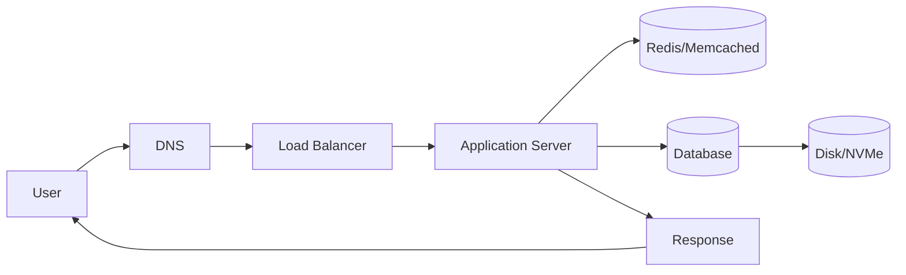
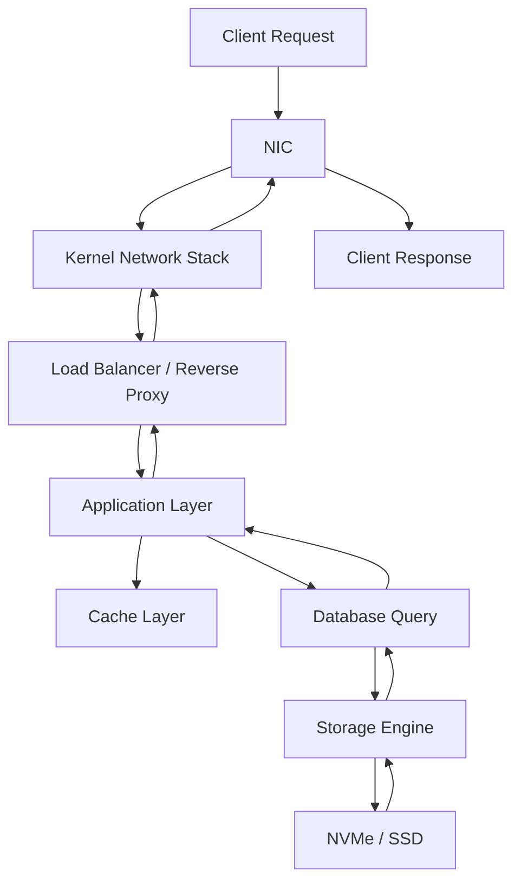

# 🏗️ Infrastructure (DevOps / SRE)

This repository provides an advanced overview of infrastructure components, focusing on **performance, scalability, reliability, and production-grade system design**.

It is intended for:

* DevOps Engineers
* Site Reliability Engineers (SREs)
* Cloud Architects
* Backend Engineers

---

#  Network Interface Card (NIC)

A NIC is responsible for packet transmission between host and network.

### Advanced Concepts:

* **SR-IOV (Single Root I/O Virtualization)** for VM-level NIC sharing
* **Offloading Features**:

  * TCP Checksum Offload
  * Large Segment Offload (LSO)
* **Bonding / Teaming**:

  * Active-Backup
  * LACP (802.3ad)

---

#  TCP vs UDP (SRE Perspective)

| Feature            | TCP                  | UDP               |
| ------------------ | -------------------- | ----------------- |
| Reliability        | Retransmission, ACKs | No retransmission |
| Congestion Control | Yes (CUBIC, BBR)     | No                |
| Ordering           | Guaranteed           | Not guaranteed    |
| Latency            | Higher               | Ultra-low         |
| Observability      | Easier (stateful)    | Harder            |

### Real-world usage:

* TCP → APIs, Databases
* UDP → DNS, Video Streaming, QUIC

---

#  Fibre Channel Protocol (FCP)

Used in **SAN environments** for high-throughput storage.

### Key Features:

* Lossless transport
* Deterministic latency
* Zoning & LUN masking
* Multipathing (MPIO)

---

#  Server Components (Production View)

### CPU

* Multi-core, hyperthreading
* NUMA architecture awareness

### Memory

* ECC RAM (error correction)
* Memory channels impact throughput

### Storage

* Tiered storage strategy

### Network

* 10G / 25G / 100G NICs
* RDMA (RoCE, iWARP)

---

#  Storage: HDD vs SSD vs NVMe

| Type | IOPS | Latency   | Use Case                         |
| ---- | ---- | --------- | -------------------------------- |
| HDD  | ~100 | High      | Cold storage                     |
| SSD  | ~10K | Medium    | General workloads                |
| NVMe | ~1M+ | Ultra-low | Databases, high-performance apps |

### NVMe Advantages:

* Parallel queues
* Direct PCIe lanes
* Lower CPU overhead

---

#  Interface Types

* **SATA** → Legacy systems
* **SAS** → Enterprise-grade reliability
* **PCIe Gen4/Gen5** → High bandwidth NVMe
* **InfiniBand / RDMA** → Ultra-low latency clusters

---

#  CPU & Nano Technology

* Process nodes (7nm, 5nm, 3nm)
* Smaller node → higher transistor density
* Better power efficiency per compute unit

### SRE Impact:

* Lower latency per request
* Better cost efficiency in cloud environments

---

#  Storage Architecture

### DAS (Direct Attached Storage)

* Low latency
* No network overhead

### NAS (Network Attached Storage)

* File-level access (NFS, SMB)

### SAN (Storage Area Network)

* Block-level access
* High availability + redundancy

---

#  RAID (Production Use)

| Level   | Use Case                       |
| ------- | ------------------------------ |
| RAID 0  | High performance (no safety)   |
| RAID 1  | Critical systems               |
| RAID 5  | Balanced workloads             |
| RAID 10 | Databases, low latency systems |

### SRE Notes:

* RAID ≠ Backup
* Monitor disk health (SMART metrics)
* Rebuild time impacts performance

---

#  Full Data Flow (End-to-End)

##  High-Level Flow



---

##  Detailed Packet Flow



---

##  Low-Level System Flow (Kernel to Disk)

```text
[User Request]
     ↓
[NIC]
     ↓
[Kernel (TCP/IP Stack)]
     ↓
[Socket Buffer]
     ↓
[Application Process]
     ↓
[System Calls (read/write)]
     ↓
[VFS (Virtual File System)]
     ↓
[Block Layer]
     ↓
[Device Driver]
     ↓
[NVMe Controller]
     ↓
[Physical Storage]
```

---

#  Observability & SRE Considerations

### Metrics to Monitor:

* Latency (P50, P95, P99)
* IOPS / Throughput
* Packet loss
* CPU steal / load average

### Tools:

* Prometheus + Grafana
* eBPF (for kernel tracing)
* tcpdump / Wireshark

---

#  Reliability & Scaling

### Techniques:

* Horizontal scaling
* Load balancing
* Circuit breaking
* Retry with exponential backoff

### High Availability:

* Multi-AZ deployments
* Failover systems
* Data replication

---

#  Key Takeaways

* Infrastructure is a **layered system**
* Performance bottlenecks can occur at any layer
* SRE focus = **latency, reliability, scalability**
* Observability is critical for production systems

---

# 👨‍💻 Author

Maintained by ***SHIVANG BHARDWAJ***

---

